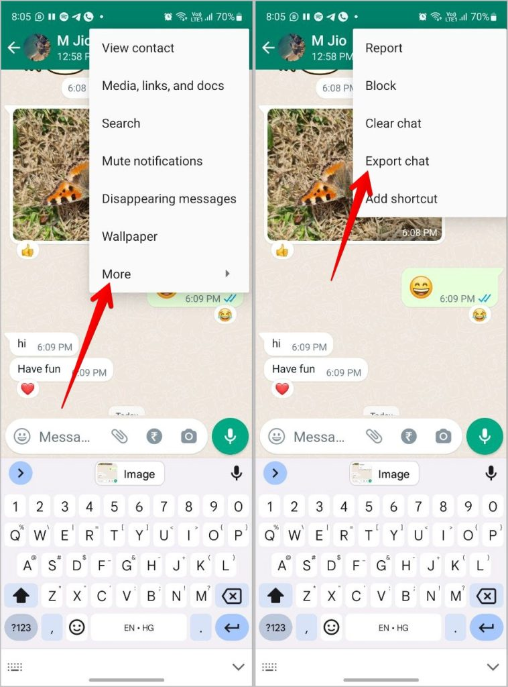
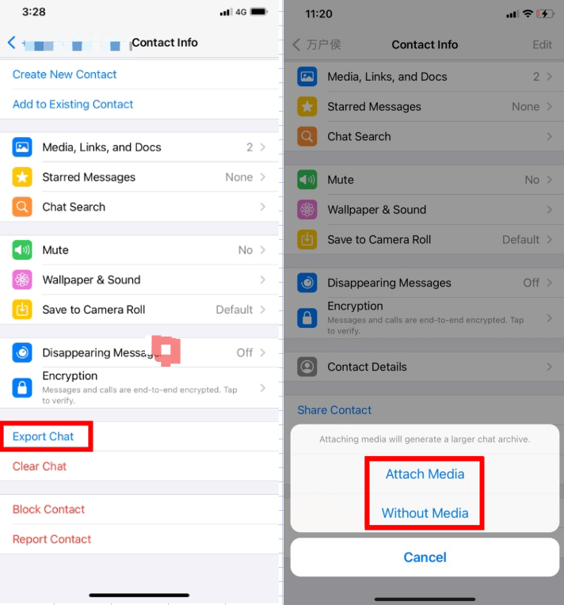

# About
This repository is a program which reads the entire WhatsApp history of a group or personal chat and gives you stats
about that chat.

# Features
### What's supported
- Average time between messages
- Total message count
- Who sent how many messages
- Group chats
- Average word count per message
- Word count
- Most used words
- Locations
- Polls
- Different types of export formats

### What's not supported yet
- Conversation detection
- Contacts
- Pings

### What's not possible to support
- Replies. This is because the 'Export Chat' option does not record if the message replies to something.
- Reaction. This is because the 'Export Chat' option does not record if the message has been reacted to.

# Usage
## Android
If you want to export a chat in WhatsApp, you first have to open a chat. When you have opened the chat, tap on the three
dots in the upper right corner of your screen. You will see a menu. Click on more, and then on "Export Chat".
Choose "without media", and you get to choose where the zip file goes. Unzip the file, rename it to chat.txt and put it
in the `/chat` directory. The program is now ready to run.

Below is a screenshot of the steps you need to take.

## iOS
If you want to export a chat in WhatsApp, you first have to open a chat. When you have opened the chat, tap on the
contact / group name. Scroll down until you see the "Export Chat" option. After you click on it, choose "without media",
and you get to choose where the zip file goes. Unzip the file, rename it to chat.txt and put it in the `/chat`
directory. The program is now ready to run.

Below is a screenshot of the steps you need to take.

